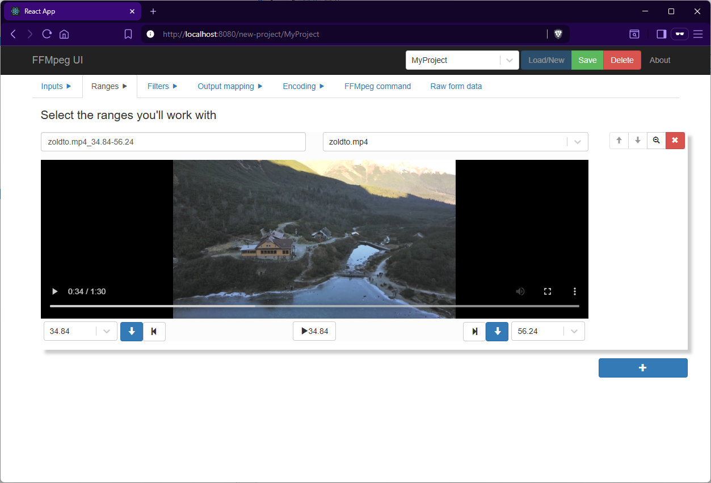

# FFMpeg UI

A web-based GUI for generating complex FFmpeg commands with dynamic form generation and visual video range selection. Build advanced video processing workflows directly in your browser with zero backend overhead. 

[Online app](https://nlacsoft.net/ffmpegui)

[Short demo video](https://nlacsoft.net/ffmpegui/ffmpegui.mp4)

## Overview

**FFMpeg UI** is a React application that abstracts FFmpeg's complexity into an intuitive, multi-step workflow interface. The application runs entirely in-browser with no backend component, allowing you to:

- Upload and manage multiple media files (video, audio)
- Visually select temporal ranges with interactive media conponent
- Build filter chains with real-time validation
- Configure encoding parameters
- Generate production-ready FFmpeg commands

## Features

### 🎬 Visual Video Range Selection

The `MediaRangeField` component provides an interactive timeline-based interface for precise temporal editing:



**Advanced Features:**
- **Dual-Mode Media Player**: Native HTML5 video/audio elements with standard playback controls
- **Frame-Accurate Selection**: Set start/end points with sub-second precision (displayed to 2 decimal places)
- **Play Between Ranges**: Automatically loops playback between selected start and end times
- **Cascading Ranges**: Creatable select dropdowns suggest end times from previously selected ranges
- **Event-Driven Updates**: Range changes trigger automatic filter chain prepending with appropriate trim/atrim filters
- **Bidirectional Sync**: Video player state stays synchronized with form data

### 🔧 Extensible Filter Chain Architecture

The application supports a composable filter system:


**Included Filters:** (so far)
- `trim` / `atrim` - Temporal range selection (video/audio)
- `scale` - Video resolution scaling with expression support
- `fade` - Fade in/out effects
- `concat` - Multi-stream concatenation with automatic parameter sync
- `setpts` - PTS adjustment for smooth transitions
- `minterpolate` - Frame interpolation

### 📊 Multi-Input Stream Mapping

The `InputStream` and `OutputStream` components provide stream mapping with:

- Media type detection (video vs audio)
- Stream specifier generation following FFmpeg conventions: `[input:type:index]`
- Type-safe mapping with `MediaType` enum
- Support for complex filter graph topologies

### ⚙️ Encoder Configuration

The `EncoderModel` generates encoder schemas from the Repository


## Tech Stack

| Layer | Technology |
|-------|-----------|
| **Frontend Framework** | React 16.8+ with React Router 5 |
| **Type Safety** | TypeScript 4.9+ (strict mode) |
| **Form System** | react-jsonschema-form + [ruled-jsonschema-form](https://github.com/nlac/ruled-jsonschema-form) |
| **Styling** | SCSS with Bootstrap 3.4 |
| **State Management** | Repository singleton + localStorage |
| **UI Components** | React-Bootstrap, React-Select (with creatable options) |
| **Media Handling** | Native HTML5 + react-dropzone |
| **Build Tools** | Create React App, Sass compiler |

## Getting Started

```bash
npm install
npm start  # Starts dev server on http://localhost:3000
```

### Browser Requirements

- **Modern browsers** with HTML5 audio/video support
- ES5+ JavaScript support (via Create React App transpilation)

